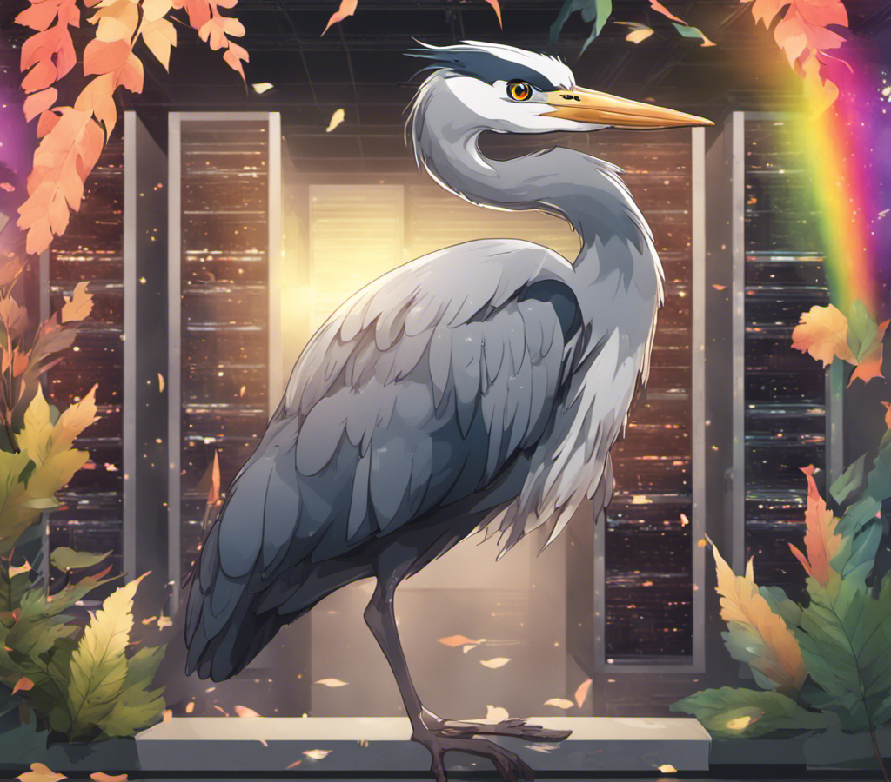
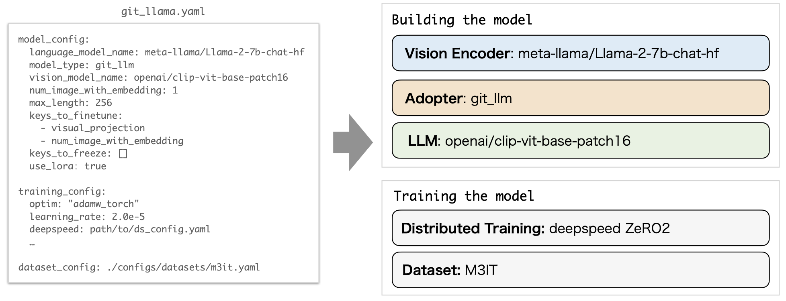

<div align="center">

# Heron
**A Library for Vision / Video and Language models**

English | [日本語](./docs/README_JP.md) | [中文](./docs/README_CN.md)
</div>


Welcome to "heron" repository. Heron is a library that seamlessly integrates multiple Vision and Language models, as well as Video and Language models. One of its standout features is its support for Japanese V&L models. Additionally, we provide pretrained weights trained on various datasets.

Demo is available from here: [[Demo](https://heron-demo.turing-motors.com/)]

<div align="center">

</div>


Heron allows you to configure your own V&L models combining various modules. Vision Encoder, Adopter, and LLM can be configured in the configuration file. The distributed learning method and datasets used for training can also be easily configured.



# Installation
## 1. Clone this repository
```bash
git clone https://github.com/turingmotors/heron.git
cd heron
```

## 2. Install Packages
We recommend using virtual environment to install the required packages. If you want to install the packages globally, use `pip install -r requirements.txt` instead.
### 2-a. Poetry (Recommended)
Using [pyenv](https://github.com/pyenv/pyenv) and [Poetry](https://python-poetry.org/), you can install the required packages as follows:
```bash
# install pyenv environment
pyenv install 3.10
pyenv local 3.10

# install packages from pyproject.toml
poetry install

# install local package
pip install --upgrade pip  # enable PEP 660 support
pip install -e .

# for development, install pre-commit
pre-commit install
``````

### 2-b. Anaconda
Using [Anaconda](https://www.anaconda.com/), you can install the required packages as follows:
```bash
conda create -n heron python=3.10 -y
conda activate heron
pip install --upgrade pip  # enable PEP 660 support

pip install -r requirements.txt
pip install -e .

# for development, install pre-commit
pre-commit install
```

## 3. Resister for Llama-2 models
To use Llama-2 models, you need to register for the models.
First, you request access to the llama-2 models, in [Hugging Face page](https://huggingface.co/meta-llama/Llama-2-7b) and [Meta website](https://ai.meta.com/resources/models-and-libraries/llama-downloads/).

Please sign-in the Hugging Face account.
```bash
huggingface-cli login
```

## 4. Flash Attention
Make sure that your environment can use the CUDA toolkit. See also [installation-and-features](https://github.com/Dao-AILab/flash-attention?tab=readme-ov-file#installation-and-features) in flash-attention.

To use flash-attention, you need to install following packages.
```bash
pip install packaging wheel
pip uninstall -y ninja && pip install ninja --no-cache-dir
pip install flash-attn --no-build-isolation
```

If flash-atten doesn't work, please install it from the source. （[Related issue](https://github.com/Dao-AILab/flash-attention/issues/821)）
```bash
cd /path/to/download
git clone https://github.com/Dao-AILab/flash-attention.git
cd flash-attention
python setup.py install
```

# Training

For learning, use the yaml configuration file under the `projects` directory.<br>
For example, the contents of [projects/opt/exp001.yml](. /projects/opt/exp001.yml) has the following contents:

```yaml
training_config:
  per_device_train_batch_size: 2
  gradient_accumulation_steps: 4
  num_train_epochs: 1
  dataloader_num_workers: 16
  fp16: true
  optim: "adamw_torch"
  learning_rate: 5.0e-5
  logging_steps: 100
  evaluation_strategy: "steps"
  save_strategy: "steps"
  eval_steps: 4000
  save_steps: 4000
  save_total_limit: 1
  deepspeed: ./configs/deepspeed/ds_config_zero1.json
  output_dir: ./output/
  report_to: "wandb"

model_config:
  fp16: true
  pretrained_path: # None or path to model weight
  model_type: git_llm
  language_model_name: facebook/opt-350m
  vision_model_name: openai/clip-vit-base-patch16
  num_image_with_embedding: 1 # if 1, no img_temporal_embedding
  max_length: 512
  keys_to_finetune:
    - visual_projection
    - num_image_with_embedding
  keys_to_freeze: []

  use_lora: true
  lora:
    r: 8
    lora_alpha: 32
    target_modules:
      - q_proj
      - k_proj
      - v_proj
    lora_dropout: 0.01
    bias: none
    task_type: CAUSAL_LM

dataset_config_path:
  - ./configs/datasets/m3it.yaml
```

`training_config` sets the training configuration, `model_config` sets the model configuration, and `dataset_config_path` sets the dataset configuration.<br>
The following LLM modules are currently supported for `model_type`. We plan to add more supported modules in the future.

- [LLama-2](https://ai.meta.com/llama/)
- [MPT](https://github.com/mosaicml/llm-foundry)
- [OPT](https://huggingface.co/docs/transformers/model_doc/opt)
- [GPT-NeoX](https://github.com/EleutherAI/gpt-neox)
- [Japanese StableLM](https://huggingface.co/stabilityai/japanese-stablelm-base-alpha-7b)
- [ELYZA-japanese-Llama-2](https://huggingface.co/elyza/ELYZA-japanese-Llama-2-7b-fast)

To start learning, execute the following command.

```bash
./scripts/run.sh
```

GPU is required for learning; we have tested on Ubuntu 20.04, CUDA 11.7.

# Evaluation

You can get the pretrained weight form Hugging Face Hub: [turing-motors/heron-chat-git-ja-stablelm-base-7b-v1](https://huggingface.co/turing-motors/heron-chat-git-ja-stablelm-base-7b-v1)<br>
See also [notebooks](./notebooks).

```python
import requests
from PIL import Image

import torch
from transformers import AutoProcessor
from heron.models.git_llm.git_japanese_stablelm_alpha import GitJapaneseStableLMAlphaForCausalLM

device_id = 0

# prepare a pretrained model
model = GitJapaneseStableLMAlphaForCausalLM.from_pretrained(
    'turing-motors/heron-chat-git-ja-stablelm-base-7b-v1', torch_dtype=torch.float16
)
model.eval()
model.to(f"cuda:{device_id}")

# prepare a processor
processor = AutoProcessor.from_pretrained('turing-motors/heron-chat-git-ja-stablelm-base-7b-v1')
tokenizer = LlamaTokenizer.from_pretrained(
    "novelai/nerdstash-tokenizer-v1",
    padding_side="right",
    additional_special_tokens=["▁▁"],
)
processor.tokenizer = tokenizer

# prepare inputs
url = "https://www.barnorama.com/wp-content/uploads/2016/12/03-Confusing-Pictures.jpg"
image = Image.open(requests.get(url, stream=True).raw)

text = f"##human: What is this picture?\n##gpt: "

# do preprocessing
inputs = processor(
    text,
    image,
    return_tensors="pt",
    truncation=True,
)
inputs = {k: v.to(f"cuda:{device_id}") for k, v in inputs.items()}

# set eos token
eos_token_id_list = [
    processor.tokenizer.pad_token_id,
    processor.tokenizer.eos_token_id,
]

# do inference
with torch.no_grad():
    out = model.generate(**inputs, max_length=256, do_sample=False, temperature=0., eos_token_id=eos_token_id_list)

# print result
print(processor.tokenizer.batch_decode(out)[0])
```

### Pretrained Models

|model|LLM module|adapter|size|
|:----:|:----|:----|:----|
|[heron-chat-git-ja-stablelm-base-7b-v1](https://huggingface.co/turing-motors/heron-chat-git-ja-stablelm-base-7b-v1)|Japanese StableLM Base Alpha|GIT|7B|
|[heron-chat-blip-ja-stablelm-base-7b-v1-llava-620k](https://huggingface.co/turing-motors/heron-chat-blip-ja-stablelm-base-7b-v1-llava-620k)|Japanese StableLM Base Alpha|BLIP|7B|
|[heron-chat-blip-ja-stablelm-base-7b-v1](https://huggingface.co/turing-motors/heron-chat-blip-ja-stablelm-base-7b-v1)|Japanese StableLM Base Alpha|BLIP|7B|
|[heron-chat-blip-ja-stablelm-base-7b-v0](https://huggingface.co/turing-motors/heron-chat-blip-ja-stablelm-base-7b-v0)|Japanese StableLM Base Alpha|BLIP|7B|
|[heron-chat-git-ja-stablelm-base-7b-v0](https://huggingface.co/turing-motors/heron-chat-git-ja-stablelm-base-7b-v0)|Japanese StableLM Base Alpha|GIT|7B|
|[heron-chat-git-ELYZA-fast-7b-v0](https://huggingface.co/turing-motors/heron-chat-git-ELYZA-fast-7b-v0)|ELYZA|GIT|7B|
|[heron-chat-git-Llama-2-7b-v0](https://huggingface.co/turing-motors/heron-chat-git-Llama-2-7b-v0)|Llama-2|GIT|7B|
|[heron-preliminary-git-Llama-2-70b-v0](https://huggingface.co/turing-motors/heron-preliminary-git-Llama-2-70b-v0) *1|Llama-2|GIT|70B|
*1 This model only applies to pre-training of adapters.

### Datasets
LLava datasets translated into Japanese.<br>
- [LLaVA-Instruct-150K-JA](https://huggingface.co/datasets/turing-motors/LLaVA-Instruct-150K-JA)
- [LLaVA-v1.5-Instruct-620K-JA](https://huggingface.co/datasets/turing-motors/LLaVA-v1.5-Instruct-620K-JA)
- [LLaVA-Pretrain-JA](https://huggingface.co/datasets/turing-motors/LLaVA-Pretrain-JA)

Evaluation dataset for Heron-Bench.<br>
- [Japanese-Heron-Bench](https://huggingface.co/datasets/turing-motors/Japanese-Heron-Bench)

# Citation

If you find Heron useful for your research and applications, please cite using this BibTex:
```bibtex
@misc{inoue2024heronbench,
      title={Heron-Bench: A Benchmark for Evaluating Vision Language Models in Japanese}, 
      author={Yuichi Inoue and Kento Sasaki and Yuma Ochi and Kazuki Fujii and Kotaro Tanahashi and Yu Yamaguchi},
      year={2024},
      eprint={2404.07824},
      archivePrefix={arXiv},
      primaryClass={cs.CV}
}
```

# Organization

[Turing Inc.](https://www.turing-motors.com/en)

# License

Released under the [Apache License 2.0](./LICENSE).

# Acknowledgements

- [GenerativeImage2Text](https://github.com/microsoft/GenerativeImage2Text): The main idia of the model is based on original GIT.
- [Llava](https://github.com/haotian-liu/LLaVA): This project is learned a lot from the great Llava project.
- [GIT-LLM](https://github.com/Ino-Ichan/GIT-LLM)
