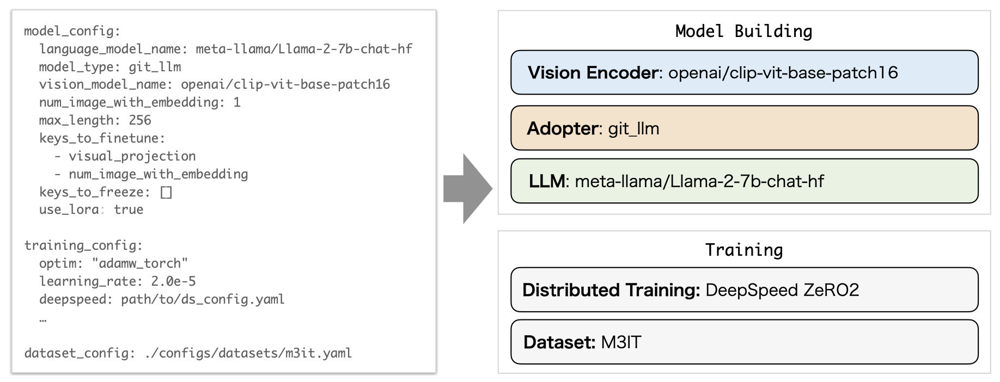

.. heron documentation master file, created by
   sphinx-quickstart on Tue Sep 12 17:08:51 2023.
   You can adapt this file completely to your liking, but it should at least
   contain the root `toctree` directive.

Heron
=================================

.. toctree::
   :maxdepth: 2
   :caption: Contents:

`[日本語] </ja/latest/>`_ | `[English] </en/latest/>`_ | [中文]

Heron是一个可无缝集成多种图像/视频和语言模型的库. 此外, 它还提供在各种数据集上训练的预训练权重.

点击此处查看使用不同 LLM 制作的多模态演示页面.（均有日语版本）

* `BLIP + Japanese StableLM Base Alpha <https://huggingface.co/spaces/turing-motors/heron_chat_blip>`_
* `GIT + ELYZA-japanese-Llama-2 <https://huggingface.co/spaces/turing-motors/heron_chat_git>`_

.. image:: ../../../images/heron_image.png
   :scale: 25%

Heron允许您结合各种模块配置自己的V&L模型. 可以在配置文件中配置视觉编码器, Adopter和LLM. 用于训练的分布式学习方法和数据集也可以轻松配置.

如何安装
---------------

1. 获取存储库
^^^^^^^^^^^^^^^^^^^^^^^^^^

.. code-block:: bash

   git clone https://github.com/turingmotors/heron.git
   cd heron

2. 设置 Python 环境
^^^^^^^^^^^^^^^^^^^^^^^^^^^^^^^^^^^^^^^^

建议使用虚拟环境安装所需软件包. 如果要全局安装软件包, 请使用 `pip install -r requirements.txt` 代替.

2-a. Poetry (Recommended)
""""""""""""""""""""""""""""""""""""""""

对于  `pyenv <https://github.com/pyenv/pyenv>`_ 和 `Poetry <https://python-poetry.org/>`_ , 请按照以下步骤安装必要的软件包.

.. code-block:: bash

   # install pyenv environment
   pyenv install 3.10
   pyenv local 3.10

   # install packages from pyproject.toml
   poetry install

   # install local package
   pip install --upgrade pip  # enable PEP 660 support
   pip install -e .

   # for development, install pre-commit
   pre-commit install

2-b. Anaconda
""""""""""""""""""""

对于 `Anaconda <https://www.anaconda.com/>`_ , 请按照以下步骤安装必要的软件包.

.. code-block:: bash

   conda create -n heron python=3.10 -y
   conda activate heron
   pip install --upgrade pip  # enable PEP 660 support

   pip install -r requirements.txt
   pip install -e .

   # for development, install pre-commit
   pre-commit install

.. attention::

   ## 3. 预申请 Llama-2 模型
   要使用 Llama-2 模型, 您需要注册您的模型.
   首先，请访问 `Hugging Face <https://huggingface.co/meta-llama/Llama-2-7b>`_ 和 `Meta <https://ai.meta.com/resources/models-and-libraries/llama- downloads/>`_ 并申请访问 llama-2 模型.

   申请通过后, 使用您的 HaggingFace 账户登录.

   .. code-block:: bash

      huggingface-cli login

学习方法
-----------------------

学习时，请使用 `projects` 目录下的 yaml 配置文件. 
例如， `projects/opt/exp001.yml <https://github.com/turingmotors/heron/blob/main/projects/opt/exp001.yml>`_ 的内容如下.

.. code-block:: yaml

   training_config:
   per_device_train_batch_size: 2
   gradient_accumulation_steps: 4
   num_train_epochs: 1
   dataloader_num_workers: 16
   fp16: true
   optim: "adamw_torch"
   learning_rate: 5.0e-5
   logging_steps: 100
   evaluation_strategy: "steps"
   save_strategy: "steps"
   eval_steps: 4000
   save_steps: 4000
   save_total_limit: 1
   deepspeed: ./configs/deepspeed/ds_config_zero1.json
   output_dir: ./output/
   report_to: "wandb"

   model_config:
   fp16: true
   pretrained_path: # None or path to model weight
   model_type: git_llm
   language_model_name: facebook/opt-350m
   vision_model_name: openai/clip-vit-base-patch16
   num_image_with_embedding: 1 # if 1, no img_temporal_embedding
   max_length: 512
   keys_to_finetune:
      - visual_projection
      - num_image_with_embedding
   keys_to_freeze: []

   use_lora: true
   lora:
      r: 8
      lora_alpha: 32
      target_modules:
         - q_proj
         - k_proj
         - v_proj
      lora_dropout: 0.01
      bias: none
      task_type: CAUSAL_LM

   dataset_config_path:
   - ./configs/datasets/m3it.yaml

training_config "为训练设置, "model_config "为模型设置，"dataset_config_path "为数据集设置. 
目前支持以下可为 `model_type` 指定的 LLM 模块. 将来会添加更多支持的模块.

* `LLama-2 <https://ai.meta.com/llama/>`_
* `MPT <https://github.com/mosaicml/llm-foundry>`_
* `OPT <https://huggingface.co/docs/transformers/model_doc/opt>`_
* `GPT-NeoX <https://github.com/EleutherAI/gpt-neox>`_
* `Japanese StableLM <https://huggingface.co/stabilityai/japanese-stablelm-base-alpha-7b>`_
* `ELYZA-japanese-Llama-2 <https://huggingface.co/elyza/ELYZA-japanese-Llama-2-7b-fast>`_

要开始学习, 请执行以下命令.

.. code-block:: bash

   ./scripts/run.sh

学习需要 GPU; 我们在 Ubuntu 20.04 和 CUDA 11.7 上对系统进行了测试.

如何使用
------------------

您可以从 Hugging Face Hub 下载训练好的模型： `turing-motors/heron-chat-git-ja-stablelm-base-7b-v0 <https://huggingface.co/turing-motors/heron-chat-git-ja-stablelm-base-7b-v0>`_ 
有关推理和训练方法的更多信息, 请参阅 `notebooks <https://github.com/turingmotors/heron/tree/main/notebooks>`_.

.. code-block:: python
   
   import requests
   from PIL import Image

   import torch
   from transformers import AutoProcessor
   from heron.models.git_llm.git_llama import GitLlamaForCausalLM

   device_id = 0

   # prepare a pretrained model
   model = GitLlamaForCausalLM.from_pretrained('turing-motors/heron-chat-git-ja-stablelm-base-7b-v0')
   model.eval()
   model.to(f"cuda:{device_id}")

   # prepare a processor
   processor = AutoProcessor.from_pretrained('turing-motors/heron-chat-git-ja-stablelm-base-7b-v0')

   # prepare inputs
   url = "https://www.barnorama.com/wp-content/uploads/2016/12/03-Confusing-Pictures.jpg"
   image = Image.open(requests.get(url, stream=True).raw)

   text = f"##Instruction: Please answer the following question concretely. ##Question: What is unusual about this image? Explain precisely and concretely what he is doing? ##Answer: "

   # do preprocessing
   inputs = processor(
      text,
      image,
      return_tensors="pt",
      truncation=True,
   )
   inputs = {k: v.to(f"cuda:{device_id}") for k, v in inputs.items()}

   # set eos token
   eos_token_id_list = [
      processor.tokenizer.pad_token_id,
      processor.tokenizer.eos_token_id,
   ]

   # do inference
   with torch.no_grad():
      out = model.generate(**inputs, max_length=256, do_sample=False, temperature=0., eos_token_id=eos_token_id_list)

   # print result
   print(processor.tokenizer.batch_decode(out))

训练有素的模型列表
------------------

.. list-table::

   * - model
     - LLM module
     - adapter
     - size
   * - `heron-chat-blip-ja-stablelm-base-7b-v0 <https://huggingface.co/turing-motors/heron-chat-blip-ja-stablelm-base-7b-v0>`_
     - Japanese StableLM Base Alpha
     - BLIP
     - 7B
   * - `heron-chat-git-ja-stablelm-base-7b-v0 <https://huggingface.co/turing-motors/heron-chat-git-ja-stablelm-base-7b-v0>`_
     - Japanese StableLM Base Alpha
     - GIT
     - 7B
   * - `heron-chat-git-ELYZA-fast-7b-v0 <https://huggingface.co/turing-motors/heron-chat-git-ELYZA-fast-7b-v0>`_
     - ELYZA
     - GIT
     - 7B
   * - `heron-preliminary-git-Llama-2-70b-v0 <https://huggingface.co/turing-motors/heron-preliminary-git-Llama-2-70b-v0>`_ *1
     - Llama-2
     - GIT
     - 70B

*1 仅限适配器预研

数据集
------------

翻译成日语的 LLava-Instruct 数据集.
`LLaVA-Instruct-150K-JA <https://huggingface.co/datasets/turing-motors/LLaVA-Instruct-150K-JA>`_

组织信息
------------

`Turing株式会社 <https://www.turing-motors.com/>`_

许可
------------

License 2.0.

Acknowledgements
------------------------

* `GenerativeImage2Text <https://github.com/microsoft/GenerativeImage2Text>`_
* `Llava <https://github.com/haotian-liu/LLaVA>`_ 
* `GIT-LLM <https://github.com/Ino-Ichan/GIT-LLM>`_ 

Index
------------

* :ref:`genindex`
* :ref:`modindex`
* :ref:`search`
